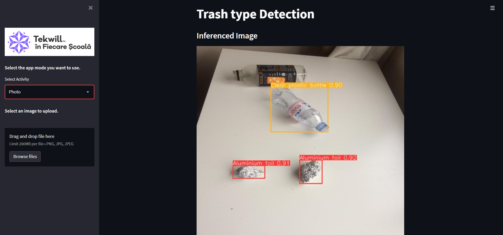
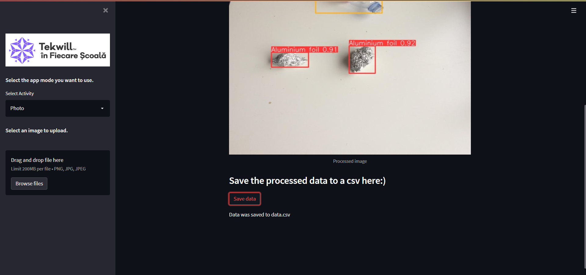
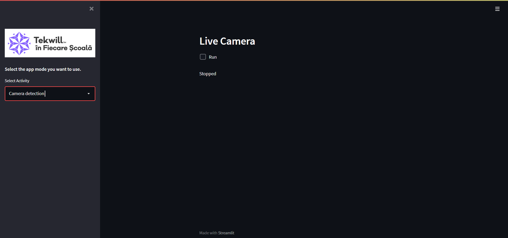

# Tekwill Junior Ambassadors

###### This is a project created by Eduard Balamatiuc and Daria Gheorghieș

---

### The problem addressed:

Serious pollution of the environment, which leads to damage to human health and the quality of ecosystems is a major problem today.
Large unmonitored areas and overcrowded with waste are red areas that indirectly end up causing diseases that sometimes lead to deaths.

---

### Our solution to the problem

> Our project represents a tool for trash detection, that can identify the trash types and give you an output with coordinates on what the model has found in the input. Besides that you can get a livetime feed of the identified objects that will be placed inside a square.

#### There are two possible settings:

- Image
  
  The Image option works based on already saved images. You need to browse and select an image from your device and afterwards the model will return you the image with identified trash objects.

  Besides that, the user has an option of exporting the data in a csv file, where he can get: the number of identified objects, the coordinated for the two points that form the square in which the identified object is placed, the probability of the detection and the type of the identified object.

  

  ---

- Video
  
  This part of the project is extremely simple and useful. First of all make sure that you have a camera on your device, afterwards, check the box Run to start the project and allow your camera to be used. Then a window with the live dstribution of the camera will appear below and you will be able to see the identified results instantly.

> An important detail to mention is that on the Video trash detection option the model is not always extremely accurate, but it still manages to make decent predictions.

